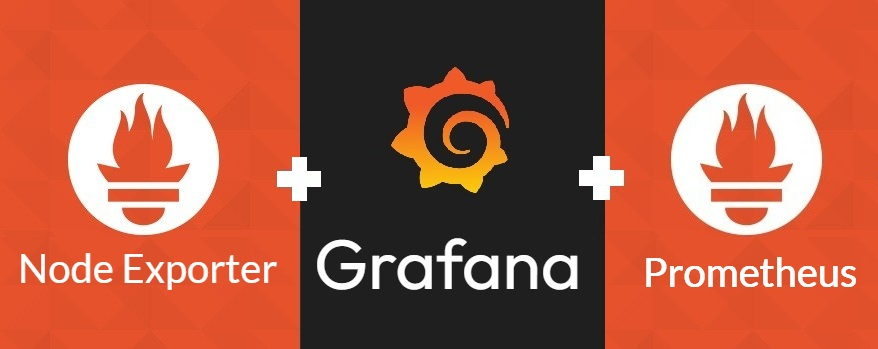

<h1 id="top" align="center">Monitor Node-Exporter <br/> 🚢 v1.1.0 🚢</h1>

<br>

<div align="center">
    
</div>

<br>

## 🔍 Table of Contents

- [Features](#features)
- [System Startup](#system-startup)

<br/>

<h2 id="features">🔥 Features</h2>

- **Docker Compose Deployment:** Simplifies deployment with Docker Compose configuration, enabling easy setup and service orchestration without complex commands.
- **Network Setup:** Integrates Node-Exporter with other metric tool networks.

<br/>

<h2 id="system-startup">🚀 System Startup</h2>

- Create a new directory named `monitor`.

```
mkdir monitor
cd monitor
```

- Clone project.

```
git clone https://github.com/ahmettoguz/monitor-node-exporter
cd monitor-node-exporter
```

- Create `network-monitor` network if not exists.

```
docker network create network-monitor
```

- Run container.

```
docker stop                              monitor-node-exporter-c
docker rm                                monitor-node-exporter-c
docker compose -p monitor up --build -d  node-exporter
docker compose -p monitor up -d          node-exporter
docker logs -f                           monitor-node-exporter-c
```

- Refer to [`cAdvisor`](https://github.com/ahmettoguz/monitor-cadvisor) repository to expose contianer metrics.

- Refer to [`Prometheus`](https://github.com/ahmettoguz/monitor-prometheus) repository to integrate prometheus to scrap metrics.

- Refer to [`Promtail`](https://github.com/ahmettoguz/monitor-promtail) repository to push traefik access logs to Loki.

- Refer to [`Loki`](https://github.com/ahmettoguz/monitor-loki) repository to scrap traefik access logs from promtail.

- Refer to [`Traefik`](https://github.com/ahmettoguz/core-traefik) repository to expose traefik access logs, metrics and also launch reverse proxy.

- Refer to [`Grafana`](https://github.com/ahmettoguz/monitor-grafana) repository to integrate grafana to visualize logs and metrics.

<br/>

### [🔝](#top)
