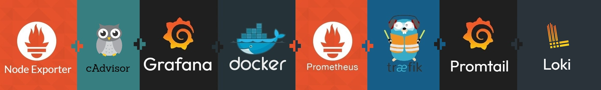
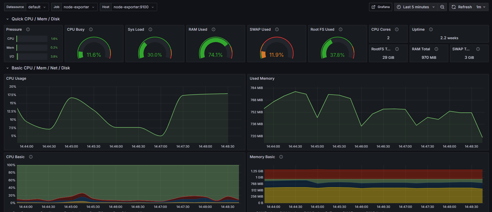

<h1 id="top" align="center">Monitor Node-Exporter</h1>

<br>

<div align="center">
    
</div>

<br>

## 🔍 Table of Contents

- [About Project](#intro)
- [Dashboard](#dashboard)
- [Technologies](#technologies)
- [Features](#features)
- [Releases](#releases)
- [System Startup](#system-startup)
- [Contributors](#contributors)

<br/>

<h2 id="intro">📌 About Project</h2>

Node Exporter introduced by Prometheus is a tool for monitoring hardware and OS metrics. This project provides an easy way to deploy Node Exporter along with the necessary configurations for integrating with Prometheus and Grafana for seamless system monitoring.

<br/>

<h2 id="dashboard">🔥 Dashboard</h2>

<div align="center">
    
</div>

<br/>

<h2 id="technologies">☄️ Technologies</h2>

&nbsp; [](https://www.docker.com/)

&nbsp; [](https://prometheus.io/docs/guides/node-exporter)

<br/>

<h2 id="features">🔥 Features</h2>

- **Docker Compose Deployment:** Simplifies deployment with Docker Compose configuration, enabling easy setup and service orchestration without complex commands.
- **Network Setup:** Integrates Node-Exporter with other metric tool networks.

<br/>

<h2 id="releases">🚢 Releases</h2>

&nbsp; [](https://github.com/ahmettoguz/monitor-node-exporter/tree/v1.0.0)

<br/>

<h2 id="system-startup">🚀 System Startup</h2>

- Create a new directory named `monitor`.

```
mkdir monitor
cd monitor
```

- Clone project.

```
git clone https://github.com/ahmettoguz/monitor-node-exporter
cd monitor-node-exporter
```

- Create `network-monitor` network if not exists.

```
docker network create network-monitor
```

- Run container.

```
docker stop                              monitor-node-exporter-c
docker rm                                monitor-node-exporter-c
docker compose -p monitor up --build -d  node-exporter
docker compose -p monitor up -d          node-exporter
docker logs -f                           monitor-node-exporter-c
```

- Refer to [`cAdvisor`](https://github.com/ahmettoguz/monitor-cadvisor) repository to expose contianer metrics.

- Refer to [`Prometheus`](https://github.com/ahmettoguz/monitor-prometheus) repository to integrate prometheus to scrap data.

- Refer to [`Grafana`](https://github.com/ahmettoguz/monitor-grafana) repository to integrate grafana to visualize node exporter data.

- Refer to [`Traefik`](https://github.com/ahmettoguz/core-traefik) repository to expose traefik metrics and also launch reverse proxy.

<br/>

<h2 id="contributors">👥 Contributors</h2>

<a href="https://github.com/ahmettoguz" target="_blank"></a>

### [🔝](#top)
